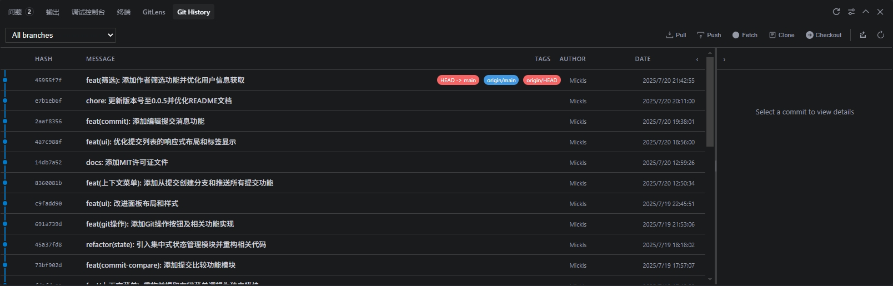

# GUI Git History - VSCode Extension

一个功能强大的可视化Git历史记录查看器，为VSCode提供专业级的Git操作界面和丰富的交互功能。支持多仓库管理、智能分支图谱、Git Blame集成等高级特性。

## ✨ 核心功能

### 📊 可视化提交历史
- **图形化分支展示** - 使用ASCII图形显示分支合并和分叉关系，智能计算提交节点位置
- **多分支视图** - 同时显示所有分支的提交历史，支持分支切换和对比
- **无限滚动加载** - 支持大型仓库的性能优化，按需加载提交记录
- **智能缓存系统** - 前后端双重缓存，提升大仓库浏览性能
- **实时更新** - 自动检测Git仓库变化并刷新显示，支持防抖优化

### 🎯 丰富的Git操作
- **基础操作工具栏**：Pull、Push、Fetch、Clone、Checkout
- **高级操作支持**：Ctrl+Click 显示高级选项（如强制推送、拉取策略等）
- **智能冲突处理**：自动暂存未提交变更的配置选项
- **右键上下文菜单**：
  - 复制提交哈希值
  - Cherry-pick 提交
  - Revert 提交
  - 编辑提交消息
  - 创建分支
  - Reset (Soft/Mixed/Hard)
  - Squash 提交
  - 推送所有提交到指定位置

### 🔍 提交详情与比较
- **详细文件变更视图** - 支持列表和树形两种显示模式，可配置默认视图
- **多提交比较** - Ctrl+Click 多选提交右键显示高级菜单进行对比，支持跨分支比较
- **文件差异查看** - 集成VSCode差异编辑器，支持内联和并排视图
- **文件历史追踪** - 查看单个文件的提交历史和变更轨迹
- **在线文件查看** - 支持查看特定提交的文件内容，无需切换分支

### 🔧 Git Blame 集成
- **行级责任追踪** - 在编辑器中显示每行代码的提交信息
- **智能显示模式** - 可配置仅显示当前行或全文件的blame信息
- **自定义格式** - 支持自定义blame信息的显示格式
- **提交详情弹窗** - 点击blame信息快速查看完整提交详情

### 🏢 多仓库管理
- **自动仓库发现** - 智能扫描工作区中的所有Git仓库
- **仓库快速切换** - 顶部下拉菜单支持在多个仓库间快速切换
- **独立状态管理** - 每个仓库维护独立的浏览状态和缓存

### 🎨 用户界面特性
- **响应式布局** - 可调整的分割面板，支持拖拽调整大小
- **面板折叠** - 支持左右面板的展开/折叠，最大化内容显示区域
- **主题适配** - 完美适配VSCode的明暗主题，支持自定义颜色
- **状态管理** - 智能的前端状态缓存和管理，保持用户操作状态
- **键盘快捷键** - 支持常用操作的键盘快捷键

## 🚀 使用指南

### 基本使用

1. **打开Git历史视图**
   - **自动激活**：打开包含Git仓库的工作区后，扩展自动激活
   - **手动打开**：使用命令面板 (`Ctrl+Shift+P`) 搜索 "Show Git History"
   - **面板位置**：底部面板的 "Git History" 标签页

2. **浏览提交历史**
   - **查看提交**：在左侧面板浏览提交列表，支持无限滚动
   - **切换仓库**：使用顶部的仓库选择器在多个仓库间切换
   - **切换分支**：使用分支选择器查看不同分支的历史
   - **查看详情**：点击任意提交在右侧面板查看详细信息

3. **Git操作**
   - **基础操作**：使用顶部工具栏的 Pull、Push、Fetch 等按钮
   - **高级选项**：按住 `Ctrl/Cmd` 点击操作按钮显示高级选项
   - **分支操作**：使用Checkout按钮创建或切换分支

### 高级功能

1. **多提交比较**
   - 按住 `Ctrl/Cmd` 点击多个提交进行多选
   - 右键选择 "Compare Selected" 查看提交间的差异
   - 支持跨分支的提交比较

2. **右键上下文菜单**
   - 右键点击任意提交访问完整的Git操作菜单
   - 支持Cherry-pick、Revert、Reset等高级Git操作
   - 可直接编辑提交消息（仅限最新提交）

3. **界面定制**
   - **面板调整**：拖拽中间分割线调整左右面板大小
   - **面板折叠**：点击面板标题栏的折叠按钮隐藏不需要的面板
   - **视图模式**：在设置中配置文件变更的默认显示模式（列表/树形）

4. **Git Blame功能**
   - 使用命令面板搜索 "Toggle Git Blame" 开启/关闭blame显示
   - 在设置中配置blame信息的显示格式和行为
   - 点击blame信息快速跳转到对应提交

## ⚙️ 配置选项

插件提供以下配置选项，可在VSCode设置中进行调整：

- **`guigit.fileViewMode`** - 文件变更的默认显示模式（list/tree）
- **`guigit.blame.enabled`** - 是否启用Git blame功能
- **`guigit.blame.showOnlyCurrentLine`** - 是否仅显示当前行的blame信息
- **`guigit.blame.format`** - Blame信息的显示格式
- **`guigit.autoStashOnPull`** - 拉取时如何处理未提交的变更（ask/always/never）

## 🎯 特性亮点

- ✅ **零配置启动** - 打开Git仓库即可使用，无需额外配置
- ✅ **性能优化** - 智能缓存和懒加载，支持大型仓库
- ✅ **多仓库支持** - 自动发现并管理工作区中的所有Git仓库
- ✅ **主题适配** - 完美支持VSCode明暗主题和自定义主题
- ✅ **直观易用** - 清晰的用户界面设计，符合VSCode设计规范
- ✅ **功能丰富** - 完整的Git操作支持，满足日常开发需求
- ✅ **Git Blame集成** - 内置blame功能，无需额外插件
- ✅ **实时更新** - 自动检测仓库变化，保持界面同步