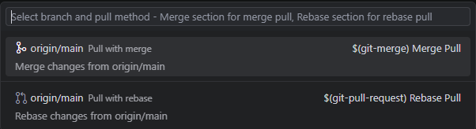

# GUI Git History - VSCode Extension

[中文文档](./README_zh.md) | English

A powerful visual Git history viewer that provides professional-grade Git operations interface and rich interactive features for VSCode. Supports multi-repository management, intelligent branch visualization, Git Blame integration, and advanced Git operations.

## ✨ Core Features

### 📊 Visual Commit History

- **Multi-branch View** - Display commit history for all branches simultaneously with branch switching and comparison
- **Infinite Scroll Loading** - Performance optimized for large repositories with on-demand commit loading
- **Smart Caching System** - Dual-layer caching (frontend/backend) for improved performance in large repositories
- **Real-time Updates** - Automatically detects Git repository changes and refreshes display with debounce optimization

### 🎯 Rich Git Operations

- **Basic Operations Toolbar**: Pull, Push, Fetch, Clone, Checkout
- **Advanced Operations Support**: Ctrl+Click to show advanced options (force push, pull strategies, etc.)
- **Smart Conflict Handling**: Configurable auto-stash for uncommitted changes
- **Right-click Context Menu**:
  - Copy commit hash
  - Cherry-pick commits
  - Revert commits
  - Edit commit messages
  - Create branches
  - Reset (Soft/Mixed/Hard)
  - Squash commits
  - Push commits to specific locations

### 🔍 Commit Details & Comparison

- **Detailed File Changes View** - Supports both list and tree display modes with configurable defaults
- **Multi-commit Comparison** - Ctrl+Click to select multiple commits and compare across branches
- **File Diff Viewer** - Integrated VSCode diff editor with inline and side-by-side views
- **File History Tracking** - View commit history and change tracking for individual files
- **Online File Viewing** - View file contents at specific commits without branch switching

### 🔧 Git Blame Integration

- **Line-level Responsibility Tracking** - Display commit information for each line of code in the editor
- **Smart Display Modes** - Configurable to show blame info for current line only or entire file
- **Custom Formatting** - Support for custom blame information display formats
- **Commit Details Popup** - Click blame info to quickly view complete commit details

### 🏢 Multi-repository Management

- **Automatic Repository Discovery** - Intelligently scans all Git repositories in the workspace
- **Quick Repository Switching** - Top dropdown menu for fast switching between multiple repositories
- **Independent State Management** - Each repository maintains independent browsing state and cache

### 🎨 User Interface Features

- **Responsive Layout** - Adjustable split panels with drag-to-resize support
- **Panel Collapsing** - Support for expanding/collapsing left and right panels to maximize content area
- **State Management** - Smart frontend state caching and management to preserve user operation state
- **Keyboard Shortcuts** - Support for keyboard shortcuts for common operations

## 🚀 Usage Guide

### Basic Usage

1. **Open Git History View**

   - **Auto Activation**: Extension automatically activates when opening a workspace with Git repositories
   - **Manual Opening**: Use Command Palette (`Ctrl+Shift+P`) and search "Show Git History"
   - **Panel Location**: "Git History" tab in the bottom panel

2. **Browse Commit History**

   - **View Commits**: Browse commit list in the left panel with infinite scroll support
   - **Switch Repositories**: Use the top repository selector to switch between multiple repositories
   - **Switch Branches**: Use branch selector to view history of different branches
   - **View Details**: Click any commit to view detailed information in the right panel

3. **Git Operations**
   - **Basic Operations**: Use toolbar buttons like Pull, Push, Fetch
   - **Advanced Options**: Hold `Ctrl/Cmd` while clicking operation buttons to show advanced options
   - **Branch Operations**: Use Checkout button to create or switch branches

### Advanced Features

1. **Multi-commit Comparison**

   - Hold `Ctrl/Cmd` and click multiple commits to multi-select
   - Right-click and select "Compare Selected" to view differences between commits
   - Support for cross-branch commit comparison

2. **Right-click Context Menu**

   - Right-click any commit to access complete Git operations menu
   - Support for Cherry-pick, Revert, Reset and other advanced Git operations
   - Direct commit message editing (latest commit only)

3. **Interface Customization**

   - **Panel Adjustment**: Drag the middle divider to adjust left/right panel sizes
   - **Panel Collapsing**: Click panel title bar collapse buttons to hide unnecessary panels
   - **View Modes**: Configure default display mode for file changes (list/tree) in settings

4. **Git Blame Features**
   - Use Command Palette and search "Toggle Git Blame" to enable/disable blame display
   - Configure blame information display format and behavior in settings
   - Click blame information to quickly jump to corresponding commit

## ⚙️ Configuration Options

The extension provides the following configuration options, adjustable in VSCode settings:

- **`guigit.fileViewMode`** - Default display mode for file changes (list/tree)
- **`guigit.blame.enabled`** - Enable Git blame functionality
- **`guigit.blame.showOnlyCurrentLine`** - Show blame info for current line only
- **`guigit.blame.format`** - Display format for blame information
- **`guigit.autoStashOnPull`** - How to handle uncommitted changes when pulling (ask/always/never)
- **`guigit.proxy.enabled`** - Enable custom proxy configuration
- **`guigit.proxy.http`** - HTTP proxy URL
- **`guigit.proxy.https`** - HTTPS proxy URL
- **`guigit.proxy.noProxy`** - No proxy for specified hosts
- **`guigit.language`** - Language preference (auto/en/zh)

## 🎯 Feature Highlights

- ✅ **Zero Configuration Startup** - Ready to use upon opening Git repositories, no additional setup required
- ✅ **Performance Optimized** - Smart caching and lazy loading, supports large repositories
- ✅ **Multi-repository Support** - Automatically discovers and manages all Git repositories in workspace
- ✅ **Theme Adaptation** - Perfect support for VSCode light/dark themes and custom themes
- ✅ **Intuitive and Easy to Use** - Clear user interface design following VSCode design standards
- ✅ **Feature Rich** - Complete Git operations support for daily development needs
- ✅ **Git Blame Integration** - Built-in blame functionality, no additional plugins required
- ✅ **Real-time Updates** - Automatically detects repository changes and keeps interface synchronized
- ✅ **Internationalization** - Support for multiple languages with auto-detection

## 📦 Installation

1. Open VSCode
2. Go to Extensions view (`Ctrl+Shift+X`)
3. Search for "GUI Git History"
4. Click Install

## 🤝 Contributing

Contributions are welcome! Please feel free to submit a Pull Request.

## 📄 License

This project is licensed under the MIT License - see the [LICENSE](LICENSE) file for details.

## 🔗 Links

- [GitHub Repository](https://github.com/Mickls/vscode-extension-guigit)
- [VSCode Marketplace](https://marketplace.visualstudio.com/items?itemName=Mickls.vscode-extension-guigit)
