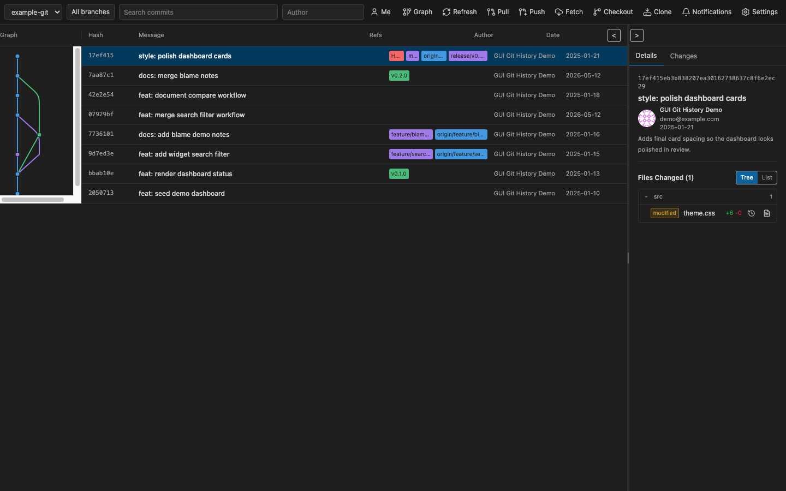
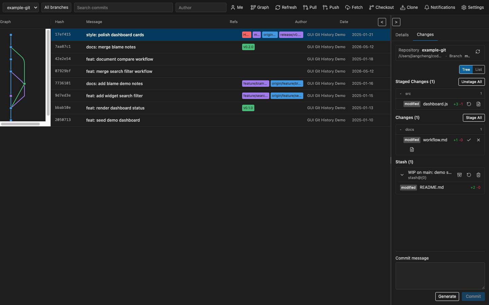
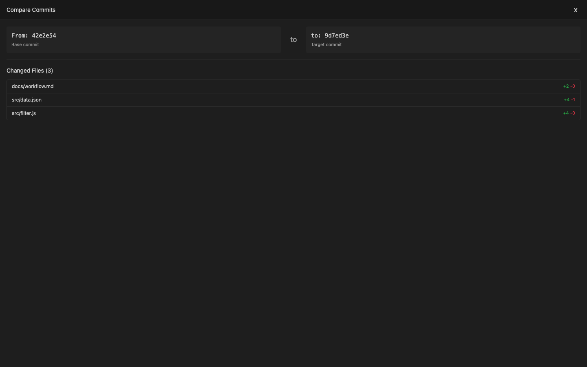
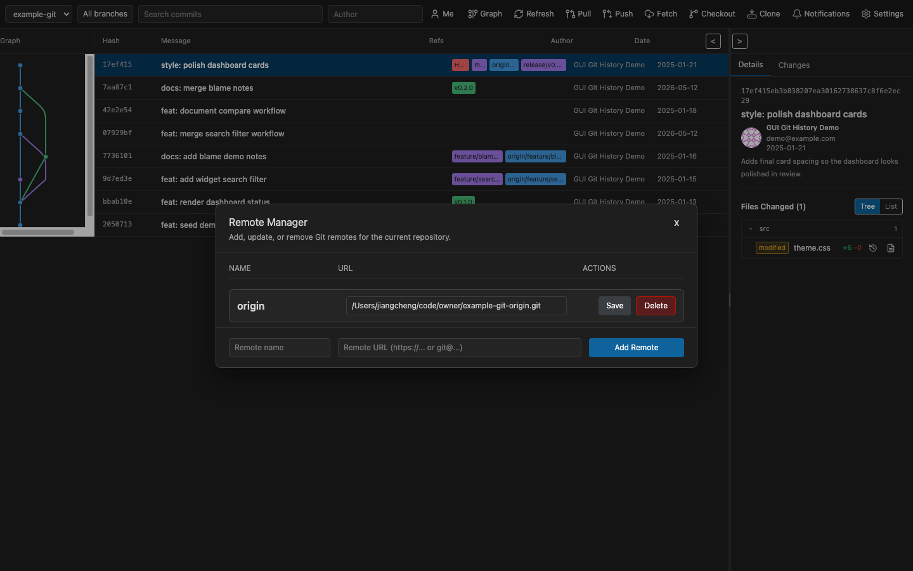
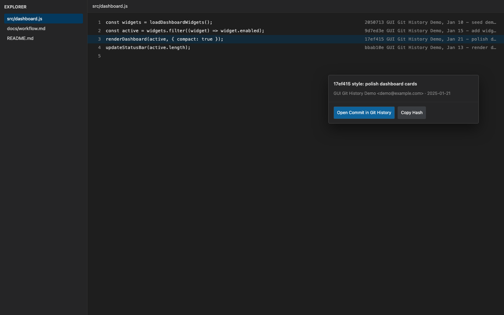

# GUI Git History

[中文说明](./README.zh-CN.md)

GUI Git History is a visual Git history workspace for VS Code. It brings the commit graph, commit details, working tree changes, commit comparison, common Git operations, remote management, proxy configuration, and inline blame into one editor-native UI.

## Why It Exists

This extension started from a familiar workflow gap. JetBrains IDEs have a visual Git experience that is easy to live in: graph on the left, commit list in the center, details and changed files beside it, with common actions close at hand. After moving to VS Code, the built-in Git UI felt too limited for that kind of history-heavy work, and many richer visual Git extensions keep comparable features behind paid tiers.

GUI Git History is built to bring that practical, JetBrains-style visual Git workflow into VS Code without making the normal daily tools feel hidden or expensive.

## Screenshots

### History, Graph, And Commit Details

Browse repositories, branches, refs, tags, authors, dates, and changed files from a dense history view. Selecting a commit keeps the graph, list, and details panel synchronized.

### Working Tree Changes

Review staged and unstaged files, stage or unstage changes, discard files, inspect stashes, generate commit messages, and commit from the **Changes** tab.

### Compare Commits

Select two commits and compare their changed files, then open file-level diffs directly from the comparison view.

### Remote Manager

List, add, edit, and delete Git remotes from the settings menu without leaving the Git history workspace.

### Inline Blame

Toggle inline blame in the editor, inspect the blamed commit from hover, open it in Git History, or copy its hash.

## Highlights

- **Interactive commit history**: switch repositories, filter by one or more branches, search commit messages or hashes, filter by author, and load more history as you scroll.
- **Git graph and commit details**: view refs, tags, parents, author metadata, commit body, changed files, insertion/deletion counts, and a selectable commit graph.
- **File change workflows**: switch between tree and list views, open commit file diffs, open working files or historical snapshots, and open a dedicated file history panel from the Explorer, editor, or commit details.
- **Working tree workflow**: inspect staged changes, unstaged changes, and stashes; stage, unstage, discard, open diffs, open files, generate a commit message, and commit.
- **Commit comparison**: select exactly two commits, compare their changed files, and open per-file diffs from the comparison view.
- **Commit actions**: copy hashes, cherry-pick, revert, reset soft/mixed/hard, squash selected commits, create a branch from a commit, push commits up to a selected commit, and edit the current HEAD commit message.
- **Toolbar Git operations**: pull, push, fetch, clone, and checkout from the webview. Command/Ctrl-click pull or push for advanced branch and strategy selection.
- **Conflict-aware operations**: continue or abort interrupted Git operations from the conflict banner when an operation needs manual resolution.
- **Remote manager**: list remotes, add new remotes, edit URLs, and delete remotes with VS Code confirmation.
- **Proxy support**: configure custom Git proxy values or refresh automatic proxy detection from VS Code, environment variables, system proxy settings, and common local proxy ports.
- **AI commit messages**: generate commit messages with the VS Code language model provider or an OpenAI-compatible chat completions endpoint.
- **Inline blame**: show current-line Git blame decorations, open a blamed commit in the history view, or copy its hash from the hover.
- **Localized UI**: use automatic VS Code language detection or choose English, Chinese, Spanish, French, German, Japanese, or Russian.
- **Diagnostics**: inspect the **GUI Git History** output channel and tune logging with `guigit.logLevel`.

## Getting Started

1. Open a folder or workspace that contains a Git repository.
2. Open **Git History** from the panel area, or run **GUI Git History: Show Git History** from the Command Palette.
3. Choose a repository from the header if your workspace contains multiple repositories.
4. Use the branch selector, search box, and author filter to narrow the history.
5. Select a commit to view details, open file diffs, compare commits, or run commit actions from the context menu.
6. Open the **Changes** tab to manage staged, unstaged, and stashed work.

## Common Workflows

### Inspect History

- Select a repository from the header.
- Choose **All branches** or select one or more specific branches.
- Search by commit message or hash prefix.
- Filter by author, or click **Me** to show commits by the current Git user.
- Toggle the graph when you want more horizontal space for the commit list.

### Review Changed Files

- Select a commit to open the details panel.
- Switch changed files between **Tree** and **List**.
- Click a file path to open its diff.
- Use the file action buttons to open the working file or that file's history.

### Manage Working Tree Changes

- Open the **Changes** tab.
- Stage or unstage individual files, or use **Stage All** and **Unstage All**.
- Open working tree diffs and files from the file actions.
- Expand stashes to inspect their files, then apply, pop, or drop them.
- Write a commit message manually or use **Generate** to ask the configured AI provider for a suggestion.

### Compare Commits

- Select two commits with Ctrl/Cmd-click.
- Open the commit context menu and choose **Compare Selected**.
- Review the changed file list and open file-level diffs as needed.

### Run Git Operations

- Use the header buttons for **Pull**, **Push**, **Fetch**, **Checkout**, and **Clone**.
- Command/Ctrl-click **Pull** to select merge/rebase and a remote branch.
- Command/Ctrl-click **Push** to select a remote branch and normal or force-with-lease mode.
- Right-click a commit for cherry-pick, revert, reset, squash, branch creation, push-to-here, hash copy, and HEAD commit message editing.

### Manage Remotes And Proxy

- Open the settings menu from the header.
- Choose **Manage Remotes** to add, edit, or delete remote URLs.
- Choose **Configure Proxy** to enable or disable custom Git proxy settings.
- Choose **Refresh Proxy** to refresh and inspect the active proxy source.

### Use Inline Blame

- Run **GUI Git History: Toggle Git Blame** from the Command Palette.
- Hover the inline blame annotation to see author, summary, date, hash, and quick actions.
- Use the hover action to open the commit in the history view or copy the hash.

## Settings

| Setting                              | Values                                           | Description                                                                    |
| ------------------------------------ | ------------------------------------------------ | ------------------------------------------------------------------------------ |
| `guigit.fileViewMode`                | `tree`, `list`                                   | Default changed-file view in commit details and the working tree panel.        |
| `guigit.language`                    | `auto`, `en`, `zh`, `es`, `fr`, `de`, `ja`, `ru` | UI language preference. `auto` follows the VS Code UI language when supported. |
| `guigit.autoStashOnPull`             | `ask`, `always`, `never`                         | How pull and safety-checked operations handle local uncommitted changes.       |
| `guigit.proxy.enabled`               | boolean                                          | Enable custom Git proxy configuration.                                         |
| `guigit.proxy.http`                  | string                                           | HTTP proxy URL, for example `http://127.0.0.1:7890`.                           |
| `guigit.proxy.https`                 | string                                           | HTTPS proxy URL, for example `http://127.0.0.1:7890`.                          |
| `guigit.proxy.noProxy`               | string                                           | Comma-separated hosts that bypass the proxy.                                   |
| `guigit.ai.provider`                 | `vscodeLanguageModel`, `openAICompatible`        | Provider used by **Generate** in the commit message box.                       |
| `guigit.ai.commitMessagePrompt.mode` | `default`, `custom`                              | Prompt rule mode used by commit message generation.                            |
| `guigit.ai.commitMessagePrompt.customRules` | string                                    | Custom prompt rules used when prompt mode is `custom`.                         |
| `guigit.ai.openAICompatible.baseUrl` | string                                           | Base URL for an OpenAI-compatible chat completions endpoint.                   |
| `guigit.ai.openAICompatible.model`   | string                                           | Model name for the OpenAI-compatible provider.                                 |
| `guigit.blame.enabled`               | boolean                                          | Enable inline Git blame annotations.                                           |
| `guigit.blame.showOnlyCurrentLine`   | boolean                                          | Show blame annotations only for the active editor line.                        |
| `guigit.blame.format`                | string                                           | Blame annotation format setting.                                               |
| `guigit.logLevel`                    | `error`, `info`, `debug`, `off`                  | Diagnostic logging level for the **GUI Git History** output channel.           |

## Commands And Menus

| Command                                  | Where to use it                                                                  |
| ---------------------------------------- | -------------------------------------------------------------------------------- |
| **GUI Git History: Show Git History**    | Command Palette; opens the Git History panel.                                    |
| **GUI Git History: Refresh**             | Command Palette and view title; reloads history.                                 |
| **GUI Git History: Toggle Git Blame**    | Command Palette; toggles inline blame annotations.                               |
| **GUI Git History: View File History**   | Command Palette, Explorer context menu, editor context menu, and file actions.   |
| **GUI Git History: Show Commit Details** | Internal and command URI workflow used by blame/file history to reveal a commit. |

The webview also exposes toolbar and context-menu actions for pull, push, fetch, clone, checkout, compare, squash, reset, cherry-pick, revert, branch creation, remote management, proxy configuration, AI commit message generation, and copy hash.

## Requirements

- VS Code `1.75.0` or newer.
- The built-in VS Code Git extension.
- A workspace folder containing a Git repository for history browsing.

## Troubleshooting

- If no repositories appear, confirm the folder is a Git repository and the built-in Git extension is enabled.
- If Git network operations fail, open the settings menu and choose **Refresh Proxy** or **Configure Proxy**.
- If history, working tree state, or operation results look stale, run **GUI Git History: Refresh**.
- If commit message generation fails, configure the AI provider from the settings menu and check the **GUI Git History** output channel.
- For useful issue reports, set `guigit.logLevel` to `debug`, reproduce the problem, then include relevant lines from the **GUI Git History** output channel.
